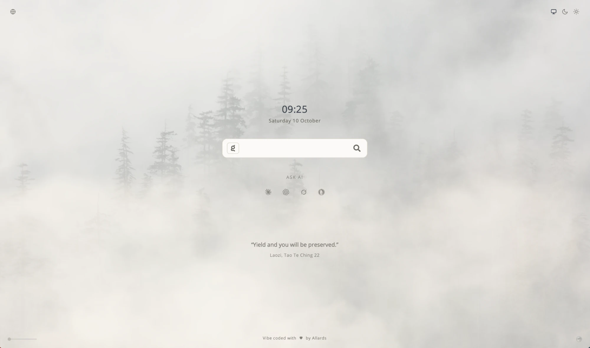
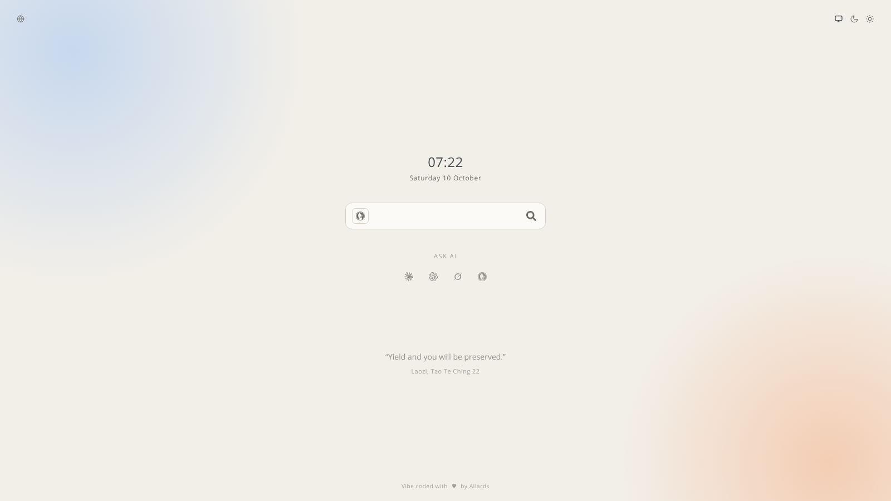
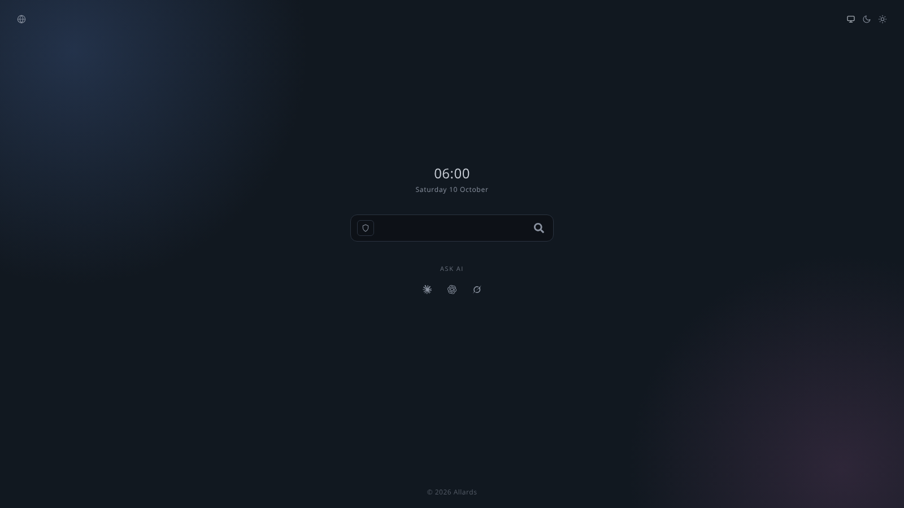

<h1 align="center">Minimal-StartPage</h1>

  A minimal start page with search, a clock, optional weather, links and a light, dark or system theme. Everything beyond the search is switched on in the settings.

  <a href="https://drallas.github.io/Minimal-StartPage/"><strong>Open the start page</strong></a>
  &nbsp;·&nbsp;
  <a href="Installation.md"><strong>Install it on your computer</strong></a>

---

<table>
  <tr>
    <td align="center">
      
       
      <b>Wallpaper mode</b>
    </td>
  </tr>
  <tr>
    <td align="center">
      
       
      <b>Light theme</b>
    </td>
  </tr>
  <tr>
    <td align="center">
      
       
      <b>Dark theme</b>
    </td>
  </tr>
</table>

## Features

Everything is optional. The settings start with a choice of page: **Minimal** (search, clock, date and the links button), **Standard** (the default, with the Ask AI shortcuts and the wallpaper) or **Full** (everything, including the quote and the time zones). Each option can still be changed on its own. Weather and your IP address are never switched on by a preset, since they send data.

- **Search.** Type a query and press Enter, or click the magnifier. The icon on the left shows the search engine: click it to switch between DuckDuckGo (the default), Kagi, Brave and Google. Your choice is remembered.
- **Clock.** The time sits above the search bar, with the date underneath. Click the time to cycle through 24-hour, 12-hour (AM/PM) and full time with seconds; the colons blink, unless your system asks for reduced motion. Hover over the time to see your time zone and its UTC offset.
- **Time zones.** Optional. A small globe above the clock opens up to five extra time zones, each with its UTC offset and a day difference when it is not today. Hover over the globe for the list; click it to change the list.
- **Date.** Hover over the date for the ISO week and the day of the year. Click it to switch between the long form and DD-MM-YYYY. The date follows your browser's language.
- **Quote.** Optional. A short quote from a philosopher or teacher, changing every six hours, in your browser's language. Click it for the next one.
- **Links.** The button at the top left opens a window with permanent links as icons (Wikipedia, Google, Apple, Facebook, X, Instagram, Microsoft, GitHub and Reuters) and up to 15 links of your own, each with an optional description. Hover the button to see your own links. The button can be switched off.
- **Ask AI.** Shortcuts below the search bar to Claude, ChatGPT, Grok and Duck.ai.
- **Weather.** Optional, off by default. The temperature and a small icon sit at the top middle. Hover for a short preview with the next six hours; click for the full forecast: the next 24 hours, the next seven days, and a link to Windy. The place comes from your IP address or from a city you choose.
- **Your IP address.** Optional, off by default. Shows your IP address just under the footer, and hovering it shows your city, country and provider.
- **Background.** A wallpaper that can be switched on or off, and a button to hide that switch. A tint slider (on a computer) gives the neutral background a colour, or the tint can be switched off. The background adapts to light and dark mode.
- **Settings and help.** Open the settings with the gear at the top right, or press `?`. They are grouped into Weather, Display, Background and Privacy. The Help button in the settings opens a guide to every feature. Press `Esc` to close.
- **Phones.** The bottom controls sit above the browser's bar, and the layout fits landscape phones too.
- **Hidden details.** A few small details are tucked away in the page. Look closely and explore.

## Use it

There are three ways to use it, from easiest to most control. You do not need to install anything for the first one.

1. **Use the online version.** Open [the start page](https://drallas.github.io/Minimal-StartPage/), bookmark it and set it as your homepage. This also works on a phone: in Safari, tap Share and then Add to Home Screen.
2. **Install a copy on your computer.** The page then works offline; only searches and the AI links need an internet connection. Download the files, unzip them, open `index.html` and set it as your homepage. Step-by-step instructions for Windows and macOS are in [Installation.md](Installation.md).
3. **Use Git.** If you already work with Git, clone the repository and pull new changes whenever you like. Details are in [Installation.md](Installation.md).

## Your data

Searches go straight to the search engine you chose. The page keeps your choices in your browser only, not on a server. Nothing leaves the page unless you switch on one of these:

- **Weather** sends your IP address to [ipapi.co](https://ipapi.co) to find your city, or the city you choose to [Open-Meteo](https://open-meteo.com) to find its coordinates. The forecast itself comes from Open-Meteo. Only while weather is on.
- **Your IP address** under the footer asks [ipapi.co](https://ipapi.co) for your address, whether or not the weather is on.

Responses are kept in your browser for 24 hours (locations) and 30 minutes (forecasts). "Reset all choices" in the settings clears everything and brings back the defaults.

## Customise

If you are comfortable editing text files, you can change the page yourself. Use any plain text editor, such as Notepad on Windows or TextEdit on macOS (set it to plain text first).

- **Permanent links:** edit `permanentLinks()` in `script.js`.
- **Search engines:** edit the `engines` list in `script.js`.
- **Colours:** edit the colours in `color.css`.

## Credits

The wallpapers are photos from [Unsplash](https://unsplash.com), used under the Unsplash License.

The weather forecast comes from [Open-Meteo](https://open-meteo.com), licensed under CC BY 4.0.

The Claude, ChatGPT, Grok, Kagi, Brave and Google icons come from [LobeHub Icons](https://github.com/lobehub/lobe-icons) (MIT). The DuckDuckGo icon and the logos of Wikipedia, Google, Apple, Facebook, X, Instagram and GitHub come from [Simple Icons](https://simpleicons.org) (CC0). Microsoft and Reuters are shown by their names, since their logos are not in the open icon set. The logos are trademarks of their owners.

The gear icon is from [Feather](https://feathericons.com) (MIT).

## License

Released under the [MIT License](LICENSE). Use, copy, modify and share it however you like. It comes without warranty, and the author is not liable for any damage.
